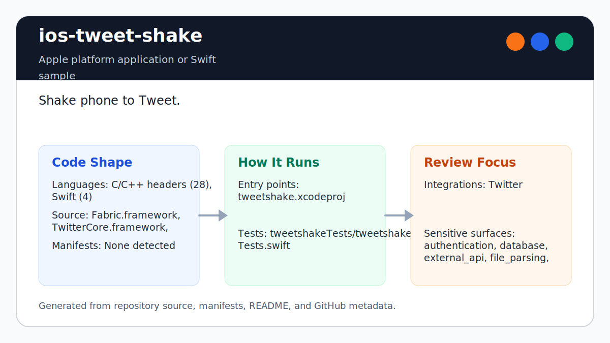

# ios-tweet-shake

<!-- README-OVERVIEW-IMAGE -->


## Overview

`garethpaul/ios-tweet-shake` is an Apple platform application or Swift sample. Shake phone to Tweet.

This README is based on the checked-in source, manifests, scripts, and repository metadata on the `master` branch. The project language mix found during review was: C/C++ headers (28), Swift (4).

## Repository Contents

- `Fabric.framework` - source or example code
- `CHANGES.md` - recent maintenance changes
- `Makefile` - local static verification entry point
- `SECURITY.md` - security reporting and disclosure guidance
- `scripts/check-baseline.py` - static TwitterKit/Fabric baseline checks
- `tweetshake` - source or example code
- `tweetshake.xcodeproj` - Xcode project file
- `tweetshakeTests` - source or example code
- `TwitterCore.framework` - source or example code
- `TwitterKit.framework` - source or example code
- `VISION.md` - project direction and maintenance guardrails

Additional scan context:

- Source directories: Fabric.framework, TwitterCore.framework, TwitterKit.framework, tweetshake, tweetshakeTests
- Dependency and build manifests: none detected
- Entry points or build surfaces: `make check`, tweetshake.xcodeproj
- Test-looking files: tweetshakeTests/tweetshakeTests.swift

## Getting Started

### Prerequisites

- Git
- Python 3 for static verification with `make check`
- macOS with Xcode for building Apple platform projects
- Fabric/TwitterKit credentials from an app you control when exercising login and compose behavior

### Setup

```bash
git clone https://github.com/garethpaul/ios-tweet-shake.git
cd ios-tweet-shake
make check
```

The committed `tweetshake/Info.plist` uses build-setting placeholders for
`FABRIC_API_KEY`, `TWITTER_CONSUMER_KEY`, and `TWITTER_CONSUMER_SECRET`. Keep
real values in local Xcode build settings, local `.xcconfig` files, or
command-line overrides.

## Running or Using the Project

- Open `tweetshake.xcodeproj` in Xcode, choose the app or sample scheme, and run it on the matching simulator/device.
- The app uses bundled legacy `Fabric.framework`, `TwitterCore.framework`, and
  `TwitterKit.framework` binaries.
- When credential build settings are empty or unresolved placeholders, the app
  skips TwitterKit startup and shows a credential setup message on the login
  screen.
- Tweet creation should remain user-confirmed through `TWTRComposer`; shaking
  the device opens the composer instead of silently posting.

Example command-line credential override:

```bash
xcodebuild -project tweetshake.xcodeproj \
  -target tweetshake \
  FABRIC_API_KEY=... \
  TWITTER_CONSUMER_KEY=... \
  TWITTER_CONSUMER_SECRET=...
```

## Testing and Verification

- `make check` runs `scripts/check-baseline.py`, which verifies Xcode project
  wiring, the committed app and test plists,
  plist/storyboard/asset files, TwitterKit login gating, shake-to-compose
  behavior, vendored framework references, credential guardrails, and
  user-confirmed posting boundaries.
- Xcode's test action or `xcodebuild test` with the appropriate scheme and destination

When the required SDK or runtime is unavailable, use static checks and source review first, then verify on a machine that has the matching platform toolchain.

## Configuration and Secrets

- Detected references to Twitter. Keep API keys, OAuth credentials, tokens, and account-specific values in local configuration only.
- Keep local `.xcconfig`, `.env`, signing, local plist overrides, and generated build files out of git.
- The checked-in Fabric/TwitterKit values must stay as build-setting placeholders, not real credentials.

## Security and Privacy Notes

- Review changes touching authentication or token handling; examples from the scan include TwitterCore.framework/Headers/TWTRAPIErrorCode.h, TwitterCore.framework/Headers/TWTRAuthSession.h, TwitterCore.framework/Headers/TWTRConstants.h, TwitterCore.framework/Headers/TWTRCoreOAuthSigning.h, and 5 more.
- Do not commit real credentials to source or app plists. Do not add silent
  posting, background account actions, or tweet-composer console logging.
- Review changes touching external API calls or credential-adjacent configuration; examples from the scan include Fabric.framework/Headers/FABAttributes.h, Fabric.framework/Headers/Fabric.h, TwitterCore.framework/Headers/TWTRAPIErrorCode.h, TwitterCore.framework/Headers/TWTRAuthConfig.h, and 6 more.
- Review changes touching network requests, sockets, or service endpoints; examples from the scan include TwitterCore.framework/Headers/TWTRAPIErrorCode.h, TwitterCore.framework/Headers/TWTRAuthConfig.h, TwitterCore.framework/Headers/TWTRCoreOAuthSigning.h, TwitterKit.framework/Headers/TWTRAPIClient.h, and 3 more.
- Review changes touching mobile permissions or privacy-sensitive device data; examples from the scan include TwitterCore.framework/Headers/TWTRConstants.h.
- Review changes touching file, media, JSON, XML, CSV, OCR, or data parsing; examples from the scan include TwitterCore.framework/Headers/TWTRConstants.h, TwitterCore.framework/Headers/TWTRCoreOAuthSigning.h, TwitterKit.framework/Headers/TWTRAPIClient.h, TwitterKit.framework/Headers/TWTRComposer.h, and 2 more.
- Review changes touching database, model, or persistence code; examples from the scan include TwitterKit.framework/Headers/TWTRTweetTableViewCell.h, TwitterKit.framework/Headers/TWTRTweetViewDelegate.h.

## Maintenance Notes

- This looks like an Apple platform project or sample. Xcode, Swift, CocoaPods, and deployment target versions may need to match the original project era.
- Run `make check` before pushing changes to Swift sources, plists,
  storyboards, assets, vendored framework references, or security docs.
- See `SECURITY.md` for vulnerability reporting and safe research guidance.
- See `VISION.md` for project direction and contribution guardrails.

## Contributing

Keep changes small and tied to the project that is already present in this repository. For code changes, document the toolchain used, avoid committing generated dependency directories or local configuration, and update this README when setup or verification steps change.
